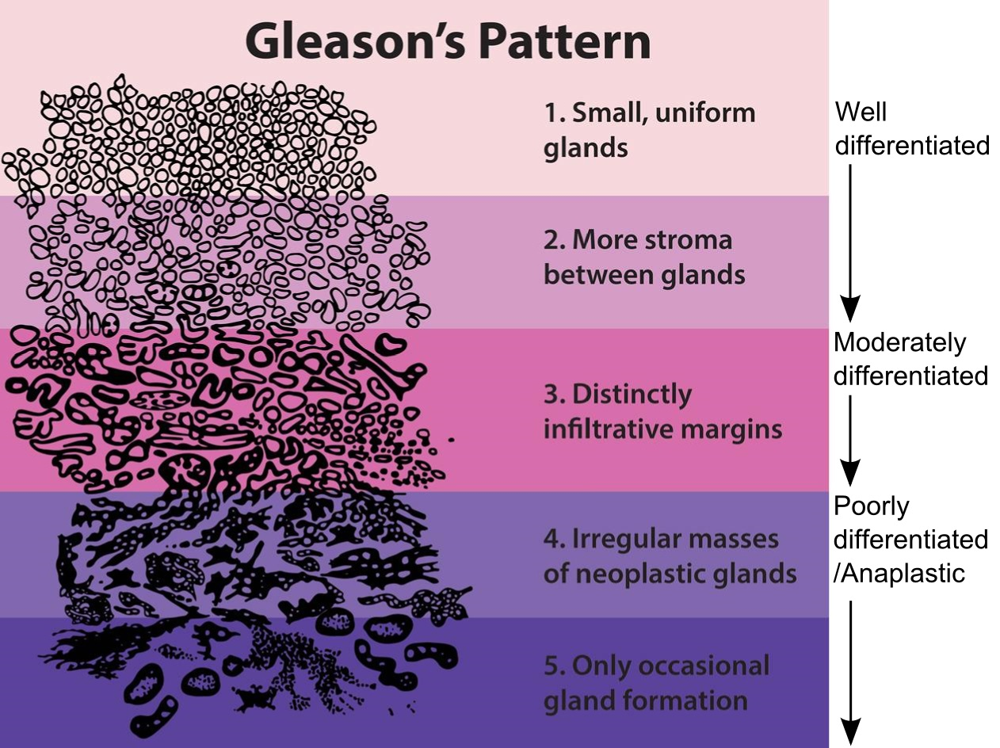

This thesis will focus on the most common form of prostate cancer, prostatic adenocarcinoma. For simplicity, we will refer to this type as just 'prostate cancer.' This disease affects one in 1.4 million men every year, making it the most prevalent common type of cancer in men (excluding skin cancers).[@Sung2021-iz] Prostate cancer is a disease of the epithelial cells of the prostate. Epithelial cells line our body cavities, hollow organs, and glands. They undergo rapid proliferation, primarily due to damage. This proliferation increases the risk of genetic mutations, ultimately increasing the risk of a cell uncontrollably dividing. Together with enabling factors of its tissue environment, this can give rise to cancer.

In general, the more aggressive cancerous cells are, the less they will behave and morphologically appear like their original function. The prostate is a gland that produces prostatic fluid. The fluid is transported to the urethra by small tubes. These tubes, called prostatic glands, are lined with epithelium. Low-grade cancer will thus mimic those gland structures. High-grade prostate cancer loses its structural morphology, forming sheets of cells or even quasi-randomly dispersed individual cancerous cells.

American pathologist Donald Floyd Gleason systematically wrote down the correlation between growth patterns and prognosis in prostate cancer in the 1960s[@cite_original]. Pathologists still use this Gleason grading, albeit several revisions later[@Epstein2016-im], to classify prostate cancer.

**Gleason's growth patterns.** Image of the Gleason score for prostate cancer grading based on the original description in 1977. From: Morphology & Grade. ICD-O-3 Morphology Codes. National Institutes of Health.[@zotero-512]

# Prognostic biomarkers

To decide on a treatment plan, clinicians divide patients into risk groups according to traditional baseline characteristics, such as PSA blood level, Gleason grade, tumor location, tumor size, and lymph node status.[lam2019] This information is gathered from histopathological, radiological assessment, and lab assessments. These assessments can be considered biomarkers as they indicate the prognosis of a patient[@chen2011]. The more precise these assessments are, the better we can tailor the treatment to the specific patient; this is known as personalized medicine.

To make treatment more tailored to the patient, researchers try to develop new biomarkers. There is a demand for new biomarkers because most prostate cancers progress so slowly that they are unlikely to threaten the affected individual's survival, and patients with the same histological and clinical characteristics, can have strikingly different outcomes [@cucchiara2018]. Being able to pick out patients with good prognoses would improve their quality of life since treatments for prostate cancer obviously have adverse effects (#tab:adverse){reference-type="ref" reference="tab:adverse"}). Equally so for patients for which we can find out the treatment will not contribute to their health. To prevent adverse effects and increase treatment response, researchers are developing new markers in genomics[@cucchiara2018], radiology[@roest2023], and pathology, the latter of which is the subject of this thesis.

\pagebreak
::: {#tab:adverse}
  ------------------------ ------------------------------- ----------------------------------------------------------------------------------------------------
  **Treatment Option**     **Disease Progression**         **Potential Adverse Effects**
  Active surveillance      Localized                       Illness uncertainty
  Radical prostatectomy    Localized                       Erectile dysfunction
                                                           Urinary incontinence
  External beam radiation  Localized and advanced disease  Urinary urgency and frequency
                                                           Dysuria, diarrhea and proctitis
                                                           Erectile dysfunction
                                                           Urinary incontinence
  Brachytherapy            Localized                       Urinary urgency and frequency
                                                           Dysuria, diarrhea and proctitis
                                                           Erectile dysfunction
                                                           Urinary incontinence
  Cryotherapy              Localized                       Erectile dysfunction
                                                           Urinary incontinence and retention
                                                           Rectal pain and fistula
  Hormone therapy          Advanced                        Fatigue
                                                           Hot flashes, and flare effect
                                                           Hyperlipidemia
                                                           Insulin resistance
                                                           Cardiovascular disease
                                                           Anemia
                                                           Osteoporosis
                                                           Erectile dysfunction
                                                           Cognitive deficits
  Chemotherapy             Advanced                        Myelosuppression
                                                           Hypersensitivity reaction
                                                           Gastrointestinal upset
                                                           Peripheral neuropathy
  ------------------------ ------------------------------- ----------------------------------------------------------------------------------------------------

  : Common Prostate Cancer Treatment Options and Potential Adverse Effects, reproduced from Dunn et al.[@dunn2011]
:::
\pagebreak

## Biomarkers based on histopathology

We know that histopathology holds prognostic information. Commonly, pathologists also report extra-capsular extension of the tumor and perineural invasion, both signs of poor prognosis. As mentioned earlier, the Gleason patterns were discovered by recording patient prognosis. Gleason growth patterns are grouped into five different groups, of which current pathologists mainly use the last three. It's not hard to imagine there being more clues in the morphology of the behavior of the tumor, if only because the landscape of prostate cancer growth patterns is certainly more complex than the three groups we divide them into. Of note, recently, the 'subpattern' cribriform-like growth was discovered to be an aggressive pattern. 

However, these visual biomarkers are hard to explicitly specify and quantify manually. Luckily, machine learning can help. The first chapter will discuss this approach further. However, it makes sense to introduce this research field, computational pathology, first.

## Computation Pathology 

Pathology is undergoing a digital revolution. More and more labs are purchasing whole-slide scanners, with some already reading most slides digitally. Glass slides are digitized, resulting in gigapixel digital images, commonly referred to as whole-slide images (WSIs). Once the data is digital, opportunities for computational analysis and assistance arise. 

Litjens et al. [1] gave an overview of deep learning applications in computational pathology up to 2016. Some early successes in the field focused on segmentation, tissue classification, and disease classification. Often reaching comparable results on the manual performance of the tasks by pathologists. Notably, the vast majority of these tasks are not on prognosis or treatment response prediction. Likely due to the fact these tasks are relatively easier and the kind of data needed is relatively cheap to obtain compared to survival data. 

All state-of-the-art methods use some flavor of deep learning. A method where we train a model with multiple layers of computations, interwoven with non-linearities. A decade ago, optimizing these neural networks on GPU accelerators became common. The use of GPU made us able to develop models with a lot of layers (hence 'deep' learning) on large datasets. From the start, we have been using a type of neural network, termed convolutional neural networks, in vision applications. 

# Convolutional neural networks

Convolutional neural networks (CNNs) have emerged among the state-of-the-art machine learning algorithms for various computer vision tasks, such as image classification and segmentation. 

The central component of a convolutional neural network is often represented as a sliding kernel (or filter) over an input matrix, producing an output matrix. See Figure 1. This has several advantages; we can use a smaller kernel than the whole making the network less complex while exploiting the fact that objects in the image are translation invariant; a cat in the upper-left corner is still a cat in the lower-right corner. We introduce this inductive bias to the network by using convolutions.

#### TODO: Figure 1.

Most convolutional neural network architectures have alternating blocks of layers consisting of a convolutional operation, a non-linear activation function, and often a normalization operation. The non-linearities are essential, as they make the networks able to represent more complex (non-linear) functions. Normalization layers bound the output of the block to be within a specific range which helps during the optimization of the network.

Even though sliding kernels are less complex than having one parameter per input value, the network architectures have evolved to become deeper and wider to enhance their accuracy further. Training larger CNNs demands larger amounts of computer memory, which increases exponentially with the size of input images. Consequently, most natural image datasets in computer vision, such as ImageNet and CIFAR-10, contain sub-megapixel images to circumvent memory limitations. 

#### TODO: Figure 2 about CNNs.

#### TODO: Overview of a whole CNN

In specific domains like remote sensing and medical imaging, there is a need to train CNNs in high-resolution, where most of the information is contained. Ideally, we want to combine the high-resolution information with a more global context, as pathologists can do during daily practice. However, computer memory becomes a limiting factor. The memory requirements of CNNs increase proportionally to the input size of the network, quickly filling up memory with multi-megapixel images. As a result, only small CNNs can be trained with such images, rendering state-of-the-art architectures unattainable even on large computing clusters.

# Weakly supervised methods 

For others, several authors have suggested approaches to train convolutional neural networks (CNNs) with large whole-slide images while preventing memory bottlenecks. 

The most common solution is to train on high-resolution, but smaller regions of the slide. These patches are combined with annotations, and this reduces the need for the whole slide to be in memory. While this reduces the context of the whole slide down to what's contained in a small patch, for common problems, this is context enough. For example, tumor classification or segmentation doesn't require the context of the whole slide.

It is possible to train with the slide-level label and patches, this approach is called Multiple-Instance Learning. Here we assume that one or a few patches are enough the predict the label. In a binary classification setting, a positive slide contains at least one positive patch and a negative slide none. Only the most informative patches per slide are used for backpropagation. [cite MIL]

Another weakly supervised approach is to train a model to compress the WSI into a lower-dimensional latent space. This model is often trained on patches, in a generative or self-supervised way. This allows us to embed the whole slide, patch-per-patch into a smaller matrix, and train a supervised network on the compression. [cite NIC/CLAM]

There are other, even more engineering-heavy, approaches to dealing with the high-resolution of slides. Such as using reinforcement learning, ...

In this thesis, a novel streaming method is proposed to train CNNs end-to-end on entire WSIs with slide-level labels. By reconstructing activations and gradients tile-by-tile, we can develop a memory-efficient implementation of the convolutional layers in a CNN. This way, a CNN can learn from full contextual information at high resolution, without relying on patches. Experiments show streaming reaches performance on par with or improving on patch-based methods needing more supervision. Thus, streaming enables direct learning from morphology to aid histopathology analysis using readily available slide-level labels. 

# Explaining discovered features

To surface additional prognostic information in histopathology slides we can leverage deep learning. This alone can help patients receive better-tailored therapy. However, if we would know more about the underlying biological processes of the cancer, we could potentially learn how to treat the disease better in general, or even prevent it from forming. Since deep learning finds features to perform the task at hand, the feature space of the network can potentially offer interesting correlations not yet discovered by scientists. This is often called a 'hypothesis-free' discovery in literature.

Besides the fact we could learn from the feature discovery of deep learning, the fact that these networks come up with features themselves make them less transparent than human-discovered features (such as Gleason growth patterns). Ultimately this could make the neural network prediction less trustworthy, because they can't be explained in common medical terms. The field of explainable AI tries to tackle these problems, and learnings from that field have been applied to computational pathology.

In the beginning of the computational pathology field, researchers investigated the feature space by visualizing the gradient signal on top of the original image [gradcam, gradient saliency]. While it does provide some information, it is generally quite difficult to assess what the model has learned. Tangible information would be to surface similar patterns across tumors of prognostic value. We would ideally show high-level human/pathology concepts. Chapter 2 will dive into this further.

#  Thesis overview

In summary, this thesis has several objectives:

> "to investigate if we could develop algorithms using the entire whole-slide images together with patient-level information."

The secondary aim of the thesis was stated as: 

> "to investigate if histopathology slides contain additional information to prognosticate patient."

Chapter 2 demonstrates a deep learning system to predict the biochemical recurrence of prostate cancer using tissue morphology. Trained on a nested case-control study and validated on an independent cohort, the system finds patterns predictive of recurrence beyond standard Gleason grading. Concept-based explanations show tissue features aligned with pathologist interpretation.

Chapter 3 proposes a method called "streaming" to train convolutional neural networks end-to-end on multi-megapixel histopathology images, circumventing memory limitations. We tile the input image and reconstruct activations and gradients, allowing the use of entire high-resolution images during training without cropping. 

Chapter 4 applies streaming to train models on whole prostate biopsy images using only slide-level labels from pathology reports. It shows a modern CNN can learn from high-resolution images without patch-level annotations. The method reaches similar performance to state-of-the-art patch-based and multiple instance learning techniques.

Furthermore, in Chapter 5, we will show the preliminary results of streaming on a prognostic task in the discussion. 

In summary, the thesis explores computational pathology methods to analyze entire high-resolution histopathology images despite memory constraints. It shows neural networks can learn from morphology to aid prostate cancer diagnosis and prognosis when trained end-to-end on whole-slide images using readily available slide-level labels.

\pagebreak
