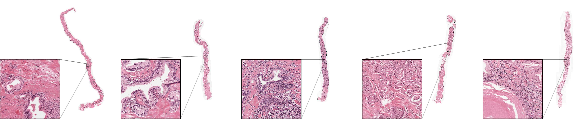
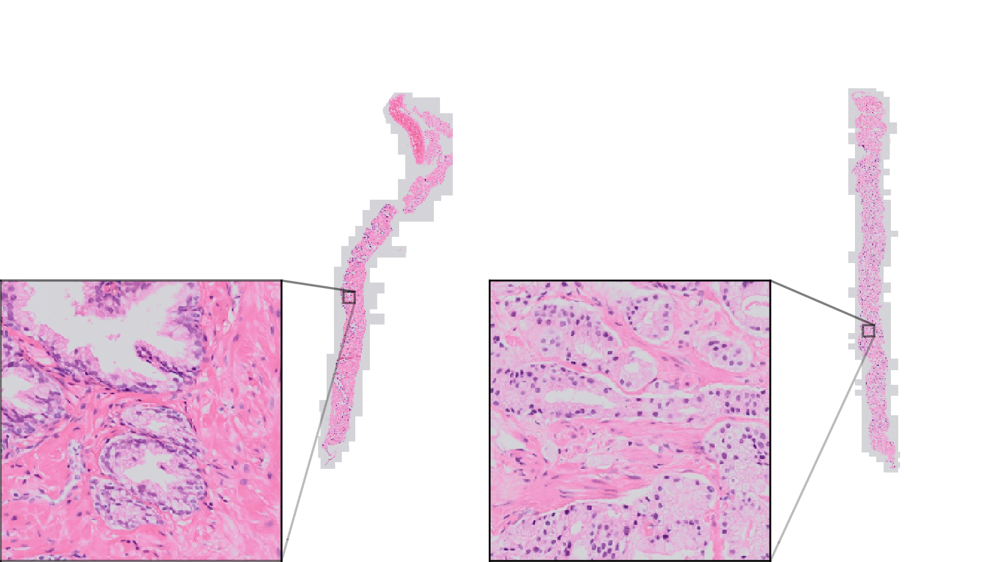
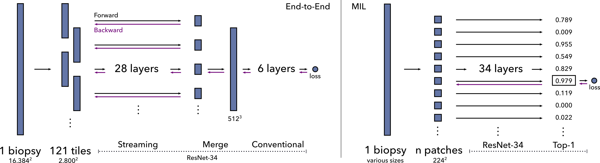
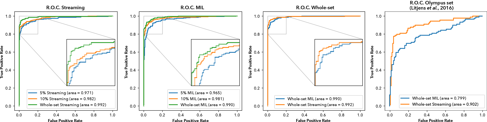
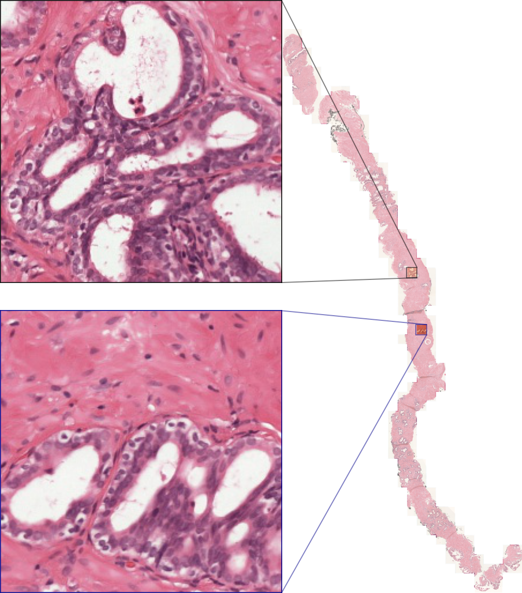
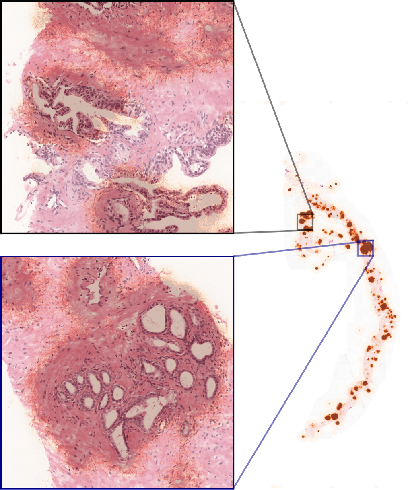
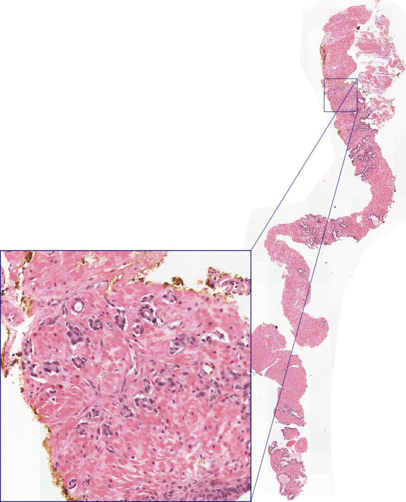
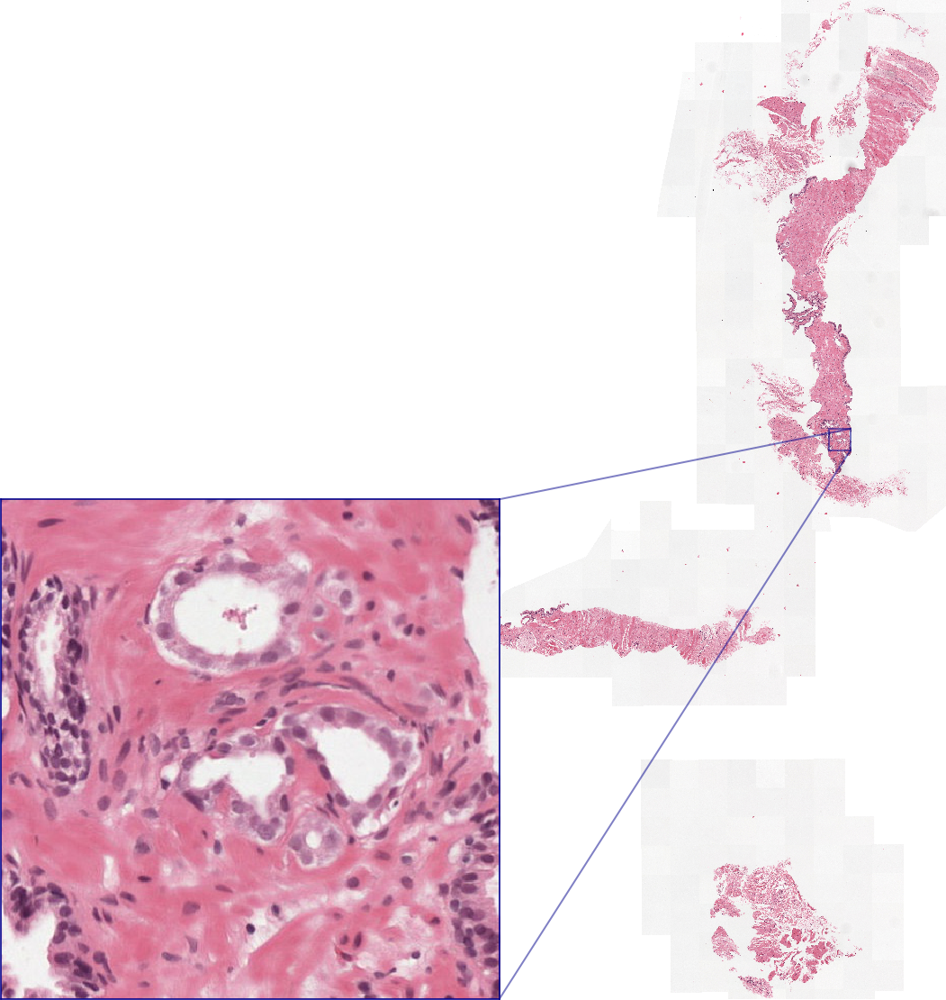
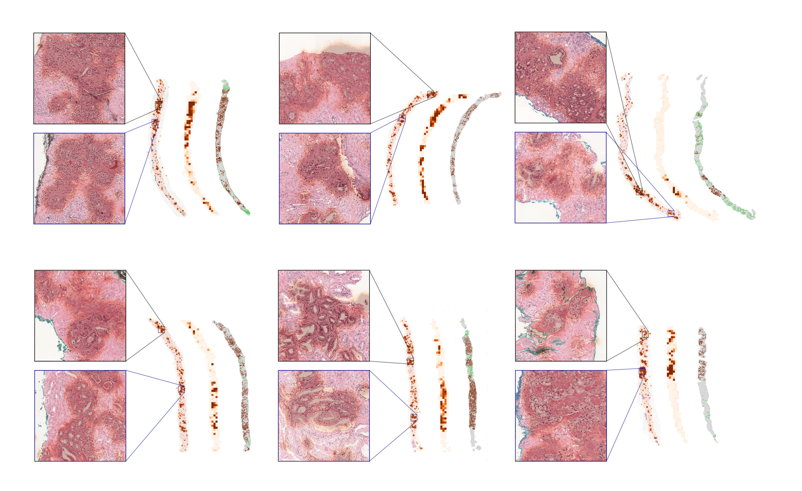
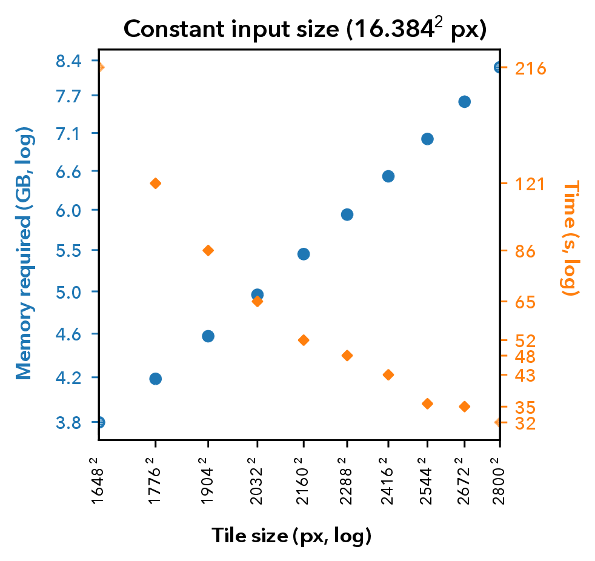

# Introduction

The current state-of-the-art in computer vision for image classification
tasks are convolutional neural networks (CNNs). Commonly, convolutional
neural networks are developed with low-resolution labeled images, for
example 0.001 megapixels for CIFAR-10[@Krizhevsky2009], and 0.09-0.26
megapixels for ImageNet[@Russakovsky2015]. These images are evaluated by
the network and the parameters are optimized with stochastic gradient
descent by backpropagating the classification error. Neural networks
learn to extract relevant features from their input. To effectively
learn relevant features, optimizing these networks requires relatively
large datasets[@Sun2017RevisitingUE].

In histopathology, due to the gigapixel size of scanned samples,
generally referred to as whole-slide images (WSIs), the memory
limitation of current accelerator cards prohibits training on the entire
image, in contrast to most of the natural images used in general
computer vision tasks. As such, most networks are trained on tiny
patches from the whole-slide image. Acquiring labels for these patches
can be expensive. They are generally based on detailed outlines of the
classes (e.g., tumor regions) by an experienced pathologist. This
outlining is not done in clinical practice, and is a tedious and
time-consuming task. This limits the dataset size for training models.
Also, we will need to create these annotations for every individual
task.

Besides time constraints, the diagnosis also suffers from substantial
inter-observer and intra-observer variability[@Ozkan2016]. For prostate
cancer, pathologists report the Gleason grading scheme[@Epstein2010].
Prognostically interesting growth patterns are categorized, resulting in
three levels of aggressiveness. When cancer is present, the reports will
mention a Gleason score, a combination of the two most informative
growth patterns. These are the most common patterns or the highest
pattern. There is disagreement in the detection of prostate cancer, as
in the grading using the Gleason scheme. Since pathologists can disagree
between therapeutically relevant growth patterns and the presence of a
tumor, there are clinically relevant consequences per individual case.

However, if we could circumvent labeling on a patch level, clinically
evaluated biopsies could be cheaply labeled using their clinical
reports. These reports contain all relevant information for clinical
decisions, and are thus of large value for machine learning algorithms.

In this paper we will focus on prostate cancer detection, determining
whether a biopsy contains cancerous glands or not. The diagnosis of
prostate cancer---the most prevalent cancer for men in Western
countries---is established by detection on histopathological slides by a
pathologist. The microscopy slides containing cross-sections of biopsies
can exhibit morphological changes to prostate glandular structures. In
low-grade tumors, the epithelial cells still form glandular structures;
however, in the case of high-grade tumors, the glandular structures are
eventually lost[@Fine2012].

In the presence of cancer, the percentage of cancerous tissue in a
prostate biopsy can be as low as 1%, the evaluation of the biopsies can
be tedious and error-prone, causing disagreement in the detection of
prostate cancer, as in the grading using the Gleason scheme[@Ozkan2016].

Besides substantial inter-observer and intra-observer variability,
diagnosing prostate cancer is additionally challenging due to increasing
numbers of biopsies as a result of the introduction of prostate-specific
antigen (PSA) testing[@10.1093/jnci/djp278]. This number is likely to
increase further due to the aging population. In the light of a shortage
of pathologists[@Wilson2018], automated methods could alleviate
workload.

To reduce potential errors and workload, recent
work[@Bulten2020; @Campanella2019; @Nagpal2019; @Litjens2016; @Arvaniti2018; @Lucas2019; @Strom2020],
has shown the potential to automatically detect prostate cancer in
biopsies. These studies either use expensive, pixel-level annotations or
train CNNs with slide-level labels only, using a patch-based approach.

One popular strategy is based on multiple-instance-learning
(MIL)[@Courtiol2018; @Ilse2018; @Amores2013]. In this approach, the
whole-slide image (WSI) is subdivided into a grid of patches. The MIL
assumption states that in a cancerous slide ('positive bag'), at least
one patch will contain tumorous tissue, whereas negative slides have no
patches containing tumour. Under this assumption, a CNN is trained on a
patch-level to find the most tumorous patch.

However, this approach has several disadvantages[@VanderLaak2019].
First, this method only works for tasks where the label can be predicted
from one individual patch and a single adversarial patch can result in a
false positive detection. Second, it is essentially a patch-based
approach, therefore, the size of the patch constrains the field-of-view
of the network.

In this paper, we propose a novel method, using
streaming[@Pinckaers2019], to train a modern CNN (ResNet-34) with 21
million parameters end-to-end to detect prostate cancer in whole-slide
images of biopsies. We also investigate the use of transfer learning
with this approach. This method does not suffer from the same
disadvantages as the aforementioned approaches based on MIL: it can use
the entire content of the whole-slide image for its prediction and the
field-of-view is not limited to an arbitrary patch-size. We compare our
approach against the methods by Campanella *et al.*[@Campanella2019] and
Bulten *et al.*[@Bulten2020]. Since deep learning algorithm in
computational pathology can suffer from bad generalization towards other
scanners[@Swiderska-Chadaj2020], we evaluated the generalization of the
MIL- and streaming-trained ResNet-34 on additional biopsies acquired
with a different scanner, previously used by Litjens *et al.*
[@Litjens2016].

The streaming implementation allows us to train a convolutional neural
network directly on entire biopsy images at high-resolution (268
megapixels) using only slide-level labels. We show that a
state-of-the-art CNN can extract meaningful features from
high-resolution images using labels from pathology reports without
additional heuristics or post-processing. Subsequently, we show that
transfer learning from ImageNet performs well for images that are 5000x
bigger than the original images used for training (224x224), improving
accuracy en decreasing train time.

{width="\\textwidth"}

{width="0.75\\columnwidth"}

# Related works

For prostate cancer detection, previous works have used more traditional
machine learning (i.e., feature-engineering)
approaches[@Gertych2015; @nguyen2017; @Naik2007]. Recently, researchers
transitioned to using deep-learning-based methods for the detection of
cancer[@Campanella2019; @Litjens2016]. Besides detection, research on
prostate cancer grading has also been
published[@Arvaniti2018; @Lucas2019; @Bulten2020].

In this work, we train on labels for individual biopsies. Since in other
work, the memory of the accelerator restricts the input size of the
image, published methods are based on searching relevant patches of the
original
slide[@Ianni2020; @Campanella2019; @lu2020data; @Li2019a; @Caner2018],
or compressing the slide into a smaller latent space[@Tellez2019].

We explicitly compare against the state-of-the-art method from
Campanella *et al.*[@Campanella2019]. As mentioned before, their
multiple-instance-learning approach is based on the single
most-informative patch, and thus leads to a small field-of-view for the
network, and potential false positives because of a few adversarial
patches. To circumvent some of these problems, Campanelle *et
al.*[@Campanella2019], tried to increase the field-of-view to multiple
patches using a recurrent neural networks with some improvement. Their
system achieved an area-under-the-receiver-operating curve (AUC) of
0.986. the aggregation method increased the AUC to 0.991. To make the
comparison fair, we trained a ResNet-34 network architecture for both
methods. However, when training end-to-end, the context of the whole
image is automatically taken into account.

Campanella *et al.* showed that performance decreases when using smaller
datasets, concluding that at least 10,000 biopsies are necessary for a
good performance. Since they did not use data augmentation (probably
because of the big dataset at hand), we investigated if we could reach
similar performances with smaller dataset sizes using data augmentation.

Since the mentioned implementation of multiple-instance-learning only
considers one patch, which may be less efficient,
others[@lu2020data; @Li2019a] improved the method by using multiple
resolution patches and attention mechanisms. Li *et al.* trained two
models on low and high resolution patches, only patches that were
predicted as suspicious by the lower resolution model were used to train
the higher resolution model. Additionally, to calculate the attention
mechanisms, all patches need to be kept in memory, limiting the size of
the patches. Lu *et al.* [@lu2020data] showed that, additionally to
attention mechanisms, a frozen model pretrained on ImageNet decreases
training time and improves data efficiency. We also use ImageNet
weights, but by using the streaming-implementation of convolutions, can
unfreeze the model and train the whole network end-to-end. However, in
both papers, no comparison to the original method of Campanella *et al.*
was performed.

# Materials

We used the same dataset as Bulten *et al.*[@Bulten2020], we will
briefly reiterate the collection of the dataset here. We built our
dataset by retrospectively collecting biopsies and associated pathology
reports of patients. Subsequently, we divided the patients between
training, validation, and test set. As standard practice, we optimized
the model using the training set and assessed generalization using the
validation set during development. After development, we evaluated the
model on the test set. The dataset, except for the test set, is publicly
available as a Kaggle challenge at
<https://www.kaggle.com/c/prostate-cancer-grade-assessment>. An
additional set, termed Olympus set, was used for evaluation with a
different scanner, originally extracted by Litjens et al[@Litjens2016].

## Data collection

We retrieved pathologists reports of prostate biopsies for patients with
a suspicion of prostate cancer, dated between Jan 1, 2012, and Dec 31,
2017, from digital patient records at the Radboud University Medical
Center, excluding patients who underwent neoadjuvant or adjuvant
therapy. The local ethics review board waived the need for informed
consent (IRB approval 2016--2275).

After anonymization, we performed a text search on the anonymized
pathology reports to divide the biopsies into positive and negative
cases. Afterward, we divided the patient reports randomly into training,
validation, and test set. By stratifying the biopsies on the primary
Gleason score, we retrieved a comparable grade distribution in all sets.
From the multiple cross-sections which were available per patient, we
selected the standard hematoxylin-and-eosin-stained glass slide
containing the most aggressive or prevalent part of malignant tissue for
scanning.

We digitized the selected glass slides using a 3DHistech Pannoramic
Flash II 250 (3DHistech, Hungary) scanner at a pixel resolution of
$0.24 \mu m$. Since each slide could contain one to six unique biopsies,
commonly with two consecutive sections of the biopsies per slide,
trained non-experts coarsely outlined each biopsy, assigning each with
either the reported Gleason score, or labeling negative, based on the
individual biopsy descriptions in the pathology report.

We collected 1243 glass slides, containing 5759 biopsies sections. After
division, the training set consisted of 4712 biopsies, the validation
set of 497 biopsies, and the test set of 550 biopsies (Table
[1](#tab:extset){reference-type="ref" reference="tab:extset"}, Fig.
[\[fig:example\]](#fig:example){reference-type="ref"
reference="fig:example"}). We extracted the individual biopsies from the
scanned slides at a pixel resolution of $0.96 \mu m$, visually
approximately equivalent to 100x total magnification (i.e., 10x
microscope objective with a standard 10x ocular lens). Subsequently, we
trimmed the whitespace around the tissue using a tissue-segmentation
neural network[@Bandi2019a].

## Reference standard test set

To determine a strong reference standard, three specialized pathologists
reviewed the slides in three rounds. In the first round, each
pathologist graded the biopsies independently. In the second round, each
biopsy for which no consensus was reached in the first round, consensus
was regraded by the pathologist whose score differed from the other two,
with the help of the pathologist's first score and the two anonymous
Gleason scores of the other pathologists. In the third round, the
pathologists discussed the biopsies without consensus after round two.
In total 15 biopsies were discarded by the panel as they could not be
reliably graded, resulting in a total test set size of 535 biopsies.
See[@Bulten2020] for a complete overview of the grading protocol.

## Smaller subsampled training set

To test our method with smaller datasets, we sampled 250 (5%) and 500
(10%) biopsies from the training set. Half of the cases in the new sets
were negatives. For the positive biopsies, we stratified on primary
Gleason grade and sampled equal amounts of each. Thus, we kept the
distribution of the positive biopsies equal over all the datasets. We
used the 5% (250 biopsies) and 10% (500 biopsies) datasets for training.
The validation- and test-sets were equal to the ones used in the
development of the model on the whole set.

::: {#tab:extset}
  **Dataset**      **Total**   **Negative**   **3**   **4**   **5**
  ---------------- ----------- -------------- ------- ------- -------
  Training set     4712        16%            32%     45%     7%
  Validation set   497         39%            23%     29%     9%
  10% set          500         50%            17%     17%     17%
  5% set           250         51%            16%     16%     16%
  Test set         535         47%            25%     19%     9%
  Olympus set      205         58%            25%     11%     4%

  : Distribution of datasets used in the experiments, stratisfied on
  primary Gleason pattern.
:::

## Olympus set

For the Olympus set, we used the slides of Litjens *et al.*, 2016
[@Litjens2016]. That set contained 255 glass slides, scanned using an
Olympus VS120-S5 system (Olympus, Japan). In comparison to the original
paper, we used all biopsies on a negative slide, instead of only one,
resulting in 291 biopsies (Fig.
[\[fig:olympusexample\]](#fig:olympusexample){reference-type="ref"
reference="fig:olympusexample"}). Since patients in this set were
biopsied in 2012, there was a small overlap with the primary dataset
used in this paper. We excluded 86 biopsies from 53 duplicate patients,
resulting in a set of 205 biopsies.

# Methods

## End-to-end streaming model

We trained a ResNet-34[@He2016] convolutional neural network. Since the
individual biopsy images differ in size, we padded or center/cropped
them to 16384$\times$`<!-- -->`{=html}16384 input. 99% of our dataset
biopsies fitted within this input size. Since padding small biopsies
results in a lot of whitespace, we changed the final pooling layer of
ResNet-34 to a global max-pool layer.

For regularization, we used extensive data augmentation. To make
augmentation of these images feasible with reasonable memory usage and
speed, we used the open-source library VIPS[@VIPS1996]. Elastic random
transformation, color augmentation (hue, saturation, and brightness),
random horizontal and vertical flipping, and rotations were applied. We
normalized the images based on training dataset statistics.

We initialized the networks using ImageNet-trained weights. As an
optimizer, we used standard SGD (learning rate of $2e-4$) with momentum
(0.9) and a mini-batch size of 16 images. Because when using streaming,
we do not have a full image on the GPU, we cannot use batch
normalization, thus we froze the batch normalization mean and variance,
using the transfer-learned ImageNet running mean and variance. We
randomly oversampled negative cases to counter the imbalance in the
dataset[@Buda2018].

For the experiments with random weights, we initialized the networks
using He *et al.*[@He2015]. We also used mixed precision training
[@micikevicius_mixed] to speed up training since these networks needed
more epochs to convergence.

::: figure*
{width="\\textwidth"}
:::

### Streaming CNN

Most convolutional neural network architectures trained for a
classification task require more memory in the first layers than in the
latter because of the large feature maps. Our previously published
method termed 'streaming'[@Pinckaers2019] circumvents these high memory
requirements in the first layers by performing the operations on a
tile-by-tile basis. This method is possible because CNNs use small
kernels; hence the result at any given location is only defined by a
small area of the input. This area is called the field-of-view. Since
the field-of-view at the beginning of a network is vastly smaller than
the full input image, we can use tiles (which have to be bigger than the
field-of-view) to perform the convolutions serially. Thereby only
requiring the amount of memory for the calculation on a single tile
instead of the whole input image. After streaming, we concatenate the
tile outputs to retrieve the complete intermediate feature map of the
last streamed layer. This complete feature map is equal to the feature
map we would get when training on a infinite-memory GPU.

During the forward pass of these memory-heavy first layers, we keep the
final layer output and remove the output of the other intermediate
layers, to save memory. We stream as many layers as needed until the
last streamed layer's output can fit into GPU memory. This feature map
can subsequently be fed through the rest of the neural network at once,
resulting in the final output.

For the backward pass, we can use a similar implementation. The last
layers, until the last streamed layer, can be backpropagated as usual.
Then, we correctly tile the gradient of the last streamed layer's
output. We use these gradient tiles for tile-by-tile backpropagation of
the streamed layers. Leveraging the input tile, we recalculate the first
layers' intermediate feature maps with a forward pass (this is commonly
called gradient checkpointing[@Chen2016a]. With the recalculated
features and the gradient tile, we can finish the backpropagation for
the respective tile. We perform this for every tile. This way, we can
recover the gradients of all parameters, as would be the case if
training with the original input image. See Figure
[\[figure:streamingSGD\]](#figure:streamingSGD){reference-type="ref"
reference="figure:streamingSGD"} for a graphical representation of the
methods.

To train the ResNet-34, we streamed with a tile size of
2800$\times$`<!-- -->`{=html}2800 (Fig.
[\[fig:memrelation\]](#fig:memrelation){reference-type="ref"
reference="fig:memrelation"}) over the first 28 layers of the network.
After these layers, the whole feature map (with dimensions
512$\times$`<!-- -->`{=html}512$\times$`<!-- -->`{=html}512) could fit
into GPU memory. It is possible to use the streaming implementation for
more layers of the network, however, to improve speed it is better to
stream until the feature map is just small enough. Finally, we fed the
map through the remaining six layers to calculate the final output.

For the experiments with random weights in mixed precision, due to the
decrease in memory usage, we could use a tile size of
3136$\times$`<!-- -->`{=html}3136 to increase speed, and decrease the
number of streamed layers to the first 27.

### Training schedule

In transfer learning, often the first layers are treated as a feature
extraction algorithm. After the feature extraction part, the second part
is trained for the specific task[@TanSKZYL18]. Since the domain of
histopathology differs significantly from the natural images in
ImageNet, we froze the first three (of the four) residual blocks of the
network (the first 27 layers) as feature extractor, only training the
last block for our task. This also has the benefit of training faster,
since we do not need to calculate gradients for the first layers. After
25 epochs, all the networks were stabilized and stopped improving the
validation loss, showing slightly lower train losses.

From these epochs, we picked a checkpoint with a low validation loss to
resume fine-tuning the whole network, unfreezing the weights of the
first three residual blocks. Due to the relatively small validation set,
the loss curve was less smooth than the training loss curve. To account
for a sporadic checkpoint with a low loss, we calculated a moving
average over five epochs. From these averages, we picked the window with
the lowest loss, taking the middle checkpoint of the averaging window.

Starting from this checkpoint, we fine-tuned the whole network with a
learning rate of $6e-5$. After approximately 50 epochs, all the networks
stopped improving. For inference, we choose the checkpoints based on a
moving average of five epochs with the lowest validation set loss. We
averaged the weights of these checkpoints to improve
generalization[@Izmailov2018].

For the streaming experiments with random weights, we used the exact
same training schedule except for the learning rate. The loss would go
to infinity in the first few batches. When training from scratch, we
could not use the first layers as feature extractor. We fine-tuned the
whole network with a learning rate of $1e-5$ requiring 100 epochs until
the validation loss did stabilized. We subsequently lowered the learning
rate to $3e-6$ for 200 epochs after which the validation loss stopped
improving.

The optimization and training procedure was fully conducted using the
validation set, the test set, and the Olympus set were untouched during
the development of the model.

### Gradient accumulation and parallelization

Gradient accumulation is a technique to do a forward and backward pass
on multiple images in series on the accelerator card, and averaging the
parameter gradients over those images. Only after averaging, we perform
a gradient descent step. Averaging the gradients over multiple images in
series results in effectively training a mini-batch of these multiple
images, while only requiring the memory for one image at a time. We used
gradient accumulation over multiple biopsies to achieve an effective
mini-batch size of 16 images.

We trained over multiple GPUs by splitting the mini-batch. For the
streaming experiments, we used four GPUs (either NVIDIA RTX 2080ti or
GTX 1080ti).

::: figure*
{width=".95\\textwidth"}
:::

## Multiple-instance-learning model

As a baseline, we implemented the multiple-instance-learning method as
described in[@Campanella2019].

This method divides the images into a grid of smaller patches with the
assumption that an individual patch could determine the image-level
label. The task is to find the most informative patch. In our binary
detection task, the most informative patch is determined by the patch
with the highest probability of tumor. If there is a patch with a high
probability of tumorous tissue, the whole biopsy is labeled tumorous.

We train such a model, per epoch, in two phases. The first phase is the
inference phase, where we process all the patches of a biopsy, thereby
finding the patch with the highest probability. This patch gets assigned
the image-level label. Then, in the training phase, using only patches
with the highest probability (the top-1 patch), the model parameters are
optimized with a loss calculated on the patch probability and the label.

We followed the implementation from Campanella *et
al.*[@Campanella2019], but tweaked it for our dataset sizes. We used
standard SGD (learning rate of $1e-5$) with momentum (0.9) with a
mini-batch size of 16 images. We froze the BatchNormalization mean and
variance, due to the smaller mini-batch size and to keep the features
equal between the inference phase and the training phase. Equally, we
oversampled negative cases to counter the imbalance in the dataset,
instead of weighting[@Buda2018].

We updated the whole model for 100 epochs when transfer learning, and
200 epochs when training from random weights. From these epochs, we
picked the checkpoint with the lowest loss using the same scheme as the
streaming model. Afterward, we trained for another 100 epochs with a
learning rate of $3e-6$. The networks trained from random initialization
on the 10% and 5% required 300 epochs. We again choose the checkpoint
based on the lowest validation set loss, using a moving average of 5
epochs. We also used weight averaging for these checkpoints.

For regularization, we used the same data augmentation as the streaming
model. We made sure that the same augmented patch was used in the
inferencing and training phase. We used ImageNet statistics to normalize
the patches.

## Quantitative evaluation

The quantitative evaluation of both methods is performed using
receiver-operating characteristic (ROC) analysis. Specifically, we look
at the area under the ROC curve. To calculate a confidence interval, we
used bootstrapping. We sampled the number of the biopsies in the set,
with replacement, and calculated the area under the
receiver-operating-curve based on the new sample. Repeating this
procedure 10.000 times resulted in a distribution from which we
calculated the 95% confidence interval (2.5 and 97.5 percentile)

## Qualitative evaluation

To assess the correlation of certain regions to the cancerous label, we
created heatmaps for both techniques. For MIL, we used the patch
probabilities. For streaming, we used sensitivity maps using
SmoothGrad[@Smilkov2017]. As implementation of SmoothGrad, we averaged
25 sensitivity maps on Gaussian-noise-augmented versions of a biopsy. We
used a standard deviation of 5% of the image-wide standard deviation for
the Gaussian noise. As a comparison, we show pixel-level segmentations
from the model published in Bulten *et al.*[@Bulten2020] as well.

In addition, we did a thorough analysis of the false positives and
negatives of both the MIL and the streaming methods.

# Experiments

We performed three experiments for both methods using three datasets.
One experiment on all the data, and two on subsampled training sets, the
10% (500 biopsies) and 5% (250 biopsies) datasets.

::: {#tab:test_results}
  **Dataset**   **Method**                     **AUC**
  ------------- ------------------------------ ----------------------
  Whole set     Streaming                      0.992 (0.985--0.997)
                MIL                            0.990 (0.984--0.995)
                Bulten *et al.*[@Bulten2020]   0.990 (0.982--0.996)
  10% set       Streaming                      0.982 (0.972--0.990)
                MIL                            0.981 (0.970--0.990)
  5% set        Streaming                      0.971 (0.960--0.982)
                MIL                            0.965 (0.949--0.978)
  Olympus set   Streaming                      0.909 (0.863--0.949)
                MIL                            0.799 (0.732--0.861)

  : Area under the receiver-operating-curve comparison between the
  methods on the test set, *trained using transfer learning*.
:::

::: {#tab:test_results_scratch}
  **Dataset**   **Method**   **AUC**
  ------------- ------------ ----------------------
  Whole set     Streaming    0.967 (0.952--0.980)
                MIL          0.918 (0.894--0.941)
  10% set       Streaming    0.924 (0.900--0.945)
                MIL          0.899 (0.871--0.924)
  5% set        Streaming    0.915 (0.889--0.939)
                MIL          0.862 (0.831--0.892)

  : Area under the receiver-operating-curve comparison between the
  methods on the test set, *trained from random initialization*.
:::

On the whole dataset, the streaming model achieved an AUC of 0.992
(0.985--0.997) and the MIL model an AUC of 0.990 (0.984--0.995).
Interestingly, our models trained on the whole dataset reached similar
performance to previous work on this dataset[@Bulten2020], which
utilized a segmentation network trained using dense annotations obtained
in a semi-supervised fashion.

For streaming, the performance on the smaller dataset sizes are similar
between the two. 5% dataset has an AUC of 0.971 (0.960--0.982) for 5%
and 0.982 (0.972--0.990) for 10% (Table
[2](#tab:test_results){reference-type="ref"
reference="tab:test_results"}). The models trained with more data
generalize better (Fig.
[\[figure:ROCcomparison\]](#figure:ROCcomparison){reference-type="ref"
reference="figure:ROCcomparison"}).

Also for multiple-instance learning there is a clear improvement going
from a model trained on the smallest dataset size, with an AUC of 0.965
(0.949--0.978), increasing to 0.981 (0.970--0.990) on the 10% dataset.

There seems to be a trend that the MIL model performs slightly worse
(Fig.
[\[figure:ROCcomparison\]](#figure:ROCcomparison){reference-type="ref"
reference="figure:ROCcomparison"}), however, this difference falls
within the confidence intervals.

In the experiments trained from random weights, there is a larger
separation between the methods, without overlap of the confidence
intervals. Streaming achieves an AUC of 0.967 (0.952--0.980) when using
the whole set (Table [3](#tab:test_results_scratch){reference-type="ref"
reference="tab:test_results_scratch"}) in comparison to MIL with 0.918
(0.894--0.941). For the 10% set using streaming also results in higher
metrics 0.924 (0.900--0.945) versus 0.899 (0.871--0.924). Finally, the
5% set gets an AUC of 0.915 (0.889--0.939) for streaming and 0.862
(0.831--0.892) for MIL.

In general, the areas identified by MIL and streaming in the heatmaps
correspond well to the pixel-level segmentations from Bulten *et al.*,
showing that both methods pick up the relevant regions for cancer
identification (Figure
[\[fig:heatmaps\]](#fig:heatmaps){reference-type="ref"
reference="fig:heatmaps"}). Most errors of the models seem to be due to
normal epithelium mimicking tumorous glands in the case for false
positives, and the small size of some tumorous regions as a possible
reason for the false negatives. (Table
[4](#tab:errors){reference-type="ref" reference="tab:errors"})

For the Olympus set, existing of biopsies scanned by the Olympus
VS-system, there is a larger separation between the methods. Streaming
reaches an AUC of 0.909 (0.863--0.949), with MIL scoring 0.799
(0.732--0.861). For this dataset, MIL has 36 false negatives versus 20
for streaming, and 8 false positive versus 5 from streaming.

Identified by the MIL
model.{width=".4\\columnwidth"} Identified by the
streaming model.{width=".37\\columnwidth"}

Small tumorous glands mimicking vessels. Missed by both
models.{width=".33\\columnwidth"} Very
limited amount of tumor (four glands), missed by the streaming
network.{width=".37\\columnwidth"}

::: {#tab:errors}
  **False positives**      **Streaming** (5)    **MIL** (13)
  ------------------------ -------------------- --------------
  Normal mimicking tumor   2                    7
  Inflammation             1                    4
  Tissue artefacts         1                    1
  Bladder epithelium       1                    0
  Colon epithelium         0                    1
  **False negatives**      **Streaming** (13)   **MIL** (12)
  Little amount of tumor   7                    4
  Tissue artefacts         3                    1
  Low-grade tumor          1                    2
  Inflammation-like        1                    2
  Unclear reason           1                    2

  : The predictions were manually judged and divided in the following
  categories. False positives and negatives were selected at the point
  of maximum accuracy in the ROC curve.
:::

::: figure*
{width="\\textwidth"}
:::

::: {#tab:times}
                              **Training**   **Fine-tuning**   **Inferencing**
  --------------------------- -------------- ----------------- -----------------
  Full precision streaming    32.3 s         12.5 s            8.5 s
  Mixed precision streaming   17.2 s         3.6 s             3.5 s
  MIL                         0.5 s          n.a.              0.25 s

  : When fine-tuning only the last six of the ResNet-34 are trained, all
  other layers are frozen. All metrics are in seconds. Preprocessing
  times not shown, in our experiments they accounted for 8 seconds for
  new biopsies. Mixed precision streaming is relatively fast due to
  bigger tile-size and one less layer to stream.
:::

# Discussion and conclusions

In this paper, we proposed using streaming[@Pinckaers2019] convolution
neural networks to directly train a state-of-the-art ResNet-34
architecture on whole prostate biopsies with slide-level labels from
pathology reports. We are the first to train such high-resolution (268
megapixels) images end-to-end, without further heuristics. Accomplishing
this without the streaming implementation would require a accelerator
card with 2.4 terabyte of memory.

We showed it is possible to train a residual neural network with biopsy
level labels and reach similar performance to a popular
multiple-instance-learning (MIL) based method. Our models trained on the
whole dataset reached an AUC of 0.992 for streaming training, and 0.990
for MIL. In addition, we achieved equal performance to a method trained
on patch-based labels, with an AUC of 0.990[@Bulten2020] on the same
dataset. Although, it should be noted that Bulten *et al.* used
weakly-supervised labels, they used a cascade of models to go from
epithelium antibody-staining to semi-automatic pixel-level annotations,
to generate a model trained at the patch level.

Looking at the failure cases (Table
[4](#tab:errors){reference-type="ref" reference="tab:errors"}),
multiple-instance-learning suffers from interpreting normal glands as
tumorous (Fig.
[\[fig:errors_pos\]](#fig:errors_pos){reference-type="ref"
reference="fig:errors_pos"} and
[\[fig:errors_neg\]](#fig:errors_neg){reference-type="ref"
reference="fig:errors_neg"}). We hypothesize this is due to the lack of
context, in all but three cases the misclassification was due to one
patch. For false negatives, both models fail when there is a small
amount of tumor, however the streaming model seems to suffer more from
this. A possible solution would be to incorporate attention mechanisms
into the network, allowing it to focus to smaller parts of the biopsy.

To study the benefits of transfer learning, we trained the networks from
randomly initialized weights according to He *et al.*[@He2015]. These
networks took longer to converge (approximately 3-4x more iterations
needed) and reached lower performances. In this case, MIL is less
capable of extracting relevant information from the patches and scores
worse than networks trained with streaming, scoring an AUC of 0.918
versus 0.959, respectively. We think training from random weights
introduced additional noise in the MIL-training process. Since some
biopsies contain cancerous tissue that only falls within a few patches,
ImageNet weights can provide a better starting point to find these
relevant patches during training. However, when training from random
initialization, the noise of the benign patches in a cancerous biopsy
may make it harder to learn. When possible, we advise the usage of
pretrained network to increase convergence speed and final performance.

MIL performs weaker than the streaming network on the Olympus set, with
the main error being misclassifying 36 biopsies with tumor as negative.
The external dataset has other color characteristics due to the
different scanner used. Since both network have been trained with the
same data augmentation, MIL seems to benefit less from this augmentation
thus generalizing worse. The improvement seen in generalization on the
Olympus set and the trend of higher performance overall suggest that
streaming extracts more meaningful features from the same dataset.

In this paper, we compared against a MIL implementation of Campanella
*et al.* In their MIL implementation, only the top-1 patch is used for
training per epoch. The method's data efficiency is reliant on how often
different patches are selected in the first phase. Our results on the
smallest dataset sample (5%, 250 slides) hint towards reduced data
efficiency for MIL. However, the performance on the smaller datasets was
already close to optimal, suggesting effective use of the transferred
ImageNet-weights. Even though it is not the same test set as in their
original paper, this seems to suggest a better performance for smaller
datasets than Campanella *et al.* reported. Hypothetically, this could
be due to data augmentation, which they did not use, and increased
randomness with smaller mini-batch size in our study.

For MIL, selecting different patches per image, every epoch, is
important to circumvent overfitting. We used lower minibatch-sizes, 16
vs 512, and learning rates, $1e-5$ vs $1e-4$ as the original
implementation[@Campanella2019]. We saw increased stability in training
using smaller mini-batch sizes and learning rates, especially for the
smaller datasets, where the whole dataset would otherwise fit in one
mini-batch. Lower mini-batch sizes increased some noise, thereby picking
different patches per epoch.

The streaming implementation of convolutional neural networks is
computationally slower than our baseline. Mainly due to the number (121)
and overlap (\~650 pixels) of the tiles during backpropagation. For
inference new slides, taking into account the preprocessing that needs
to happen (roughly 8 seconds for extracting patches or extracting the
whole biopsy), MIL takes half the time (8.25 seconds) compared to
streaming (16.5 seconds) (Table IV). The most significant difference
lies in the train speed, where for full precision, streaming is \~65
times slower than MIL (Table [5](#tab:times){reference-type="ref"
reference="tab:times"}). Streaming did require half the number of epochs
needed to converge, but the gap is still large. However, an algorithm
only needs to be trained once, and the inference speed for both
streaming and MIL is fast enough for use in clinical practice.

{width="0.6\\columnwidth"}

Improving the speed of the streaming implementation of convolutional
operations is of interest. In this work, we improved training speed by
first freezing the first layers of the neural network, not having to
calculate gradients. Using this training scheme in the
multiple-instance-learning baseline resulted in unstable training and
worse performance. Further research could focus on decreasing the number
of calculations needed by using variable input sizes[^3] or lower-level
implementations that ignore whitespace, such as sparse implementations
of convolutions[@park_faster_2016].

Streaming training with high-resolution images opens up the possibility
to quickly gather large datasets with labels from pathology reports to
train convolutional neural networks. Although linking individual
biopsies to the pathology report is still a manual task, it is more
efficient than annotating the individual slides. However, some pathology
labs will manufacture one slide per biopsy and report systematically on
these individual biopsies. Training from a whole slide, with multiple
biopsies, is left for future research.

Since multiple-instance-learning, in the end, predicts the final label
on a single patch, tasks that require information from different sites
of the biopsy could be hard to engineer in this framework. For example,
in the Gleason grading scheme, the two most informative growth patterns
are reported. These patterns could lie on different parts of the biopsy,
outside of the field-of-view of a single patch. Also, additional growth
patterns could be present. The first reported growth pattern of Gleason
grading is the most prevalent. Since multiple-instance-learning works
patch-based, volumes that span larger than one patch are not used for
the prediction. Streaming allows for training complex tasks, such as
cancer grading, even with slide-level labels.

Our heatmaps show that indeed the streaming model uses information from
multiple regions in the biopsy (Fig.
[\[fig:heatmaps\]](#fig:heatmaps){reference-type="ref"
reference="fig:heatmaps"}). Even though our model is not trained on a
patch-level, the sensitivity maps highlight similar regions as the MIL
method and the segmentation algorithm from Bulten *et al.* Thus,
interestingly, a modern convolutional neural network, originally
developed for tiny input sizes, can extract useful information from 268
megapixel images.

Besides allowing the entire slide to inform predictions, streaming
training also has the advantage of being able to learn with hard or
impossible to annotate global information. For example, in the medical
domain, survival prediction can be of great interest. Future work could
be to predict survival from histopathology tissue directly. Reliably
annotating for this task can be difficult. Since streaming can find
patterns and features from the whole image using just the retrospective
patient prognosis, this method can be beneficial in automatically
finding new relevant biomarkers.

We provide source code of the streaming pipeline at GitHub[^4]. We tried
to make it easy to use with other datasets. Additionally to methods used
in this paper, we added mixed precision support for even more memory
efficient and faster training.

[^1]: Manuscript submitted on June 6, 2020. This work was supported by
    the Dutch Cancer Society under Grant KUN 2015-7970.

[^2]: Hans Pinckaers, Wouter Bulten, Jeroen van der Laak and Geert
    Litjens are with the Computational Pathology Group, Department of
    Pathology, Radboud Institute for Health Sciences, Radboud University
    Medical Center, Nijmegen, The Netherlands; E-mail: {hans.pinckaers,
    wouter.bulten, jeroen.vanderlaak, geert.litjens}\@radboudumc.nl.
    Additionally, Jeroen van der Laak is with the Center for Medical
    Image Science and Visualization, Linköping University, Linköping,
    Sweden.

[^3]: An example implementation of this can be found in the open source
    repository.

[^4]: <https://github.com/DIAGNijmegen/pathology-streaming-pipeline>
