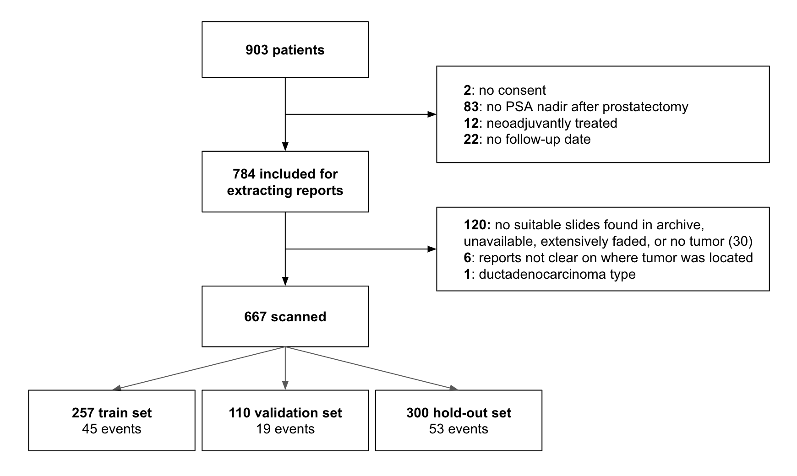

## Thesis summary 

<!-- In this PhD thesis, we addressed the main problem of the dimensionality of whole slide images in computational pathology and prostate cancer prognosis. These images are so large that previous works typically focused on the patch level or employed pre-trained mechanisms to predict clinically relevant endpoints based on the whole slides. --> 

In the **first chapter**, we presented background material regarding computational pathology, specifically on the potential of deep learning to improve prognostication for people suffering from prostate cancer. We explained the importance of prognostication. The primary aim of this thesis was:

> "to investigate if we could develop algorithms using pathology slides together with patient-level information. 

The secondary aim of the thesis was stated as: 

> 'to investigate if histopathology slides contain additional information to prognosticate patient.'

To tackle the first aim, we proposed in the **second chapter**, a new method termed streaming, which aims to solve the dimensionality problem with a memory-efficient implementation of convolutions. We demonstrated that this approach is numerically equivalent to regular convolutions used in convolutional neural networks, and decreases memory usage by 99%+. Additionally, we showed that we can converge convolutional neural networks implemented with this method and that increasing the resolution leads to higher performance in histopathology tasks due to the increase in detail. 

In the **third chapter**, we employed this new method to predict prostate cancer on whole slide images. When compared to a competitive multiple-instance learning method, the streaming method outperformed and demonstrated better generalization to an unseen scanner. We also showed that using gradient saliency, the method has gradients with large values around tumor areas. These gradient saliency maps correspond to the predictions of a multiple-instance learning network and tumor localization, indicating their correlation to the classification endpoint

This work showed that backpropagation through a binary label, towards a multi-megapixel image is sufficient to find signal end to end. Interestingly, chapter 3 revealed that the streaming method is data-efficient, even compared to multiple instance learning, which utilizes patches. We hypothesize that the amount of patches is less important since we still have the same amount of signal in the data (the number of labeled samples). It could also be that employing very large feature maps counters overfitting since the number of parameters of a kernel is relatively smaller. Furthermore, we use an aggregation layer later in the network while the feature map is still relatively large, making it more difficult to overfit specific noise.

Switching to the second aim of the thesis, in the **fourth chapter**, we demonstrated that our method can predict prostate cancer recurrence in patients after prostatectomy. By using histology data, we could further improve our prognostication for these patients beyond typical clinical variables, such as Gleason scores. We also demonstrated that by clustering latent space of a neural network, we can define concepts that explain the final predictions. These concepts corresponded to patterns used by pathologists for decades. Interestingly the concepts also showed the importance of cribiforma-like growth, only recently surfaced as an important feature in the histopathology literature. Finally, this chapter laid the foundation for extracting these features from whole slide images since, in this work, we used predefined extracted areas from the original slide based on the highest-grade tumor.  

## Concluding remarks and further research

This thesis showed that we can optimize state-of-the-art convolutional neural networks, in a straightforward end-to-end fashion, given only small constraints and achieve state-of-the-art results. Additionally, tissue morphology contains additional signal to prognosticate patients, and this can be extracted by neural networks.

A natural next step would be to optimize a CNN on whole-slide images on a cohort of prostate cancer patients to a survival endpoint. We started on this endeavor and we would like to present preliminary results here.

## Work in progress

At our hospital, we collected a cohort of patient of 903 patients which underwent prostatectomy, with follow-up information. Primary endpoint for this cohort was biochemical recurrence. This dataset, collected by the Urology department recorded biochemical recurrence by monitoring ordered lab tests of included patients. These tests were ordered by treating physicians in the hospital, or outside by general practitioners. Generally, after one year of follow-up, patients are transferred to their general practitioner for monitoring. 

{width="\\textwidth"}

<!-- @Geert: Do we know who helped us ? -->

Code to train can be found here: /Users/Hans/PhD/pathology-streaming-pipeline/survival

This hypothesis was explored in the final chapter, where we analyzed whole slide images of a population cohort of patients who had undergone prostatectomy. We attempted to predict the time to biochemical recurrence for these patients. Although we could not achieve statistically significant results due to the size of the dataset, there was a discernible signal in the slides. Using explainability methods, we demonstrated that the network focuses on the tumor and other relevant areas. This lays the groundwork for fully learning end-to-end, clinically interesting endpoints from histology images while harnessing the full potential of neural networks to find relevant features without manual feature engineering. One could argue that working on patches adds assumptions to the task and lacks context due to cropping the slide. However, deep learning has shown that neural networks can learn these assumptions and signals themselves, given enough data and appropriate labels. 

### Quote Stephans work.

## Generalization

One of the challenges in this field is the problem of model generalization.
Many publications focus on creating a variation of a model for a specific
dataset, which may not generalize well to other datasets, containing slides of
different labs or different scanners. This may be the result of differences in
color distribution, compression, or image properties in various datasets. To
bring these algorithms into the clinic, it is essential to address the bias in
the networks.

## Academic and industry overlap

Unfortunately, the current academic incentives means that a lot of effort in
the research community is not focused on these core problems in the field.
Several factors contribute to this, such as funding concerns, the need for PhD
students to publish, and the competitive nature of the field. This leads to an
unfair competition where larger AI firms with more resources drive the field
forward, while academia often lags behind. [TODO fix dictation]So another class
that I see of the problem of tracking smallest plural fast pathologist was
using deep learning as a alright, let's switch and put them in it's still
fairly easy to get a tornado set for certain Mainly in the event of a task with
the baton of this and trading them off the shelf for small variation of
existing model on them.This is almost guaranteed to work and it might be almost
the wonders of finally creating a publication, given the incentives of a PhD,
in this country, everyone needs to publish a certain number of papers.It is
very appealing to go this route.Since it is still happening in radiology of
fields, which has been digitized way earlier than pathology. I'm afraid that
these publications will keep getting written and worked on in the near future.
It is telling that when asking around, people rarely read each other's research
in this field, attempting to read the papers of the bigger AI discussing
methods. In my opinion, this leads to research that reinvents the wheel all of
the time and doesn't build upon each other. And given the hype of deep
learning, given a big enough dataset, it is still possible to publish in a very
high impact journal.We published a Gleason grading algorithm in a very high
impact journal. And, cynically, we could say that we already knew it was going
to work if we did not do that. AI researchers in this field will not learn that
much from this paper, physicians may learn that it's possible to do these tasks
at an expert level. But I hope that this is soon not a surprise anymore and
everybody knows that given enough data, these algorithms can find the right
patterns. Another issue is the career ladder in academia, where personal
publications are very important. This may lead to researchers focusing on
short-term projects that are not as impactful in the long run. In my opinion,
academia, funded by public money and without profit incentives, should focus on
long-term goals and moon-shot ideas, leaving short-term projects to companies
that can develop and implement them more quickly. On short term research, as
mentioned above, like smaller papers, smaller tasks. In my opinion, when you
can create an algorithm that is commercially interesting, meaning it can
actually be implemented and sold in the clinic and you can develop this
algorithm within a year, it may not make sense to develop those in academia,
but let companies develop them. Since academia is funded by public money and
doesn't have any profit incentive they should focus on the long-term work, on
moonshot ideas. With the risk of not getting funding and the fact that PhD
students have to publish, make this unlikely to happen. Meaning that right now,
academia is doing a lot of similar work as companies do, often with way less
funding. This leads to an unfair advantage or unfair competition. The companies
often have way more hardware. Especially in the field of image analysis in
general. After language processing you see that bigger AI firms with large sums
of money drive the field forward. And academia often hobbles  after those
companies. Nonetheless, fundamental research remains crucial, and the
importance of computational pathology and prostate cancer prognosis should not
be underestimated. It is essential to continue exploring new methods and
techniques to improve patient outcomes and advance the field.

## Bigger picture

The computational pathology field has started working on predicting
human-defined features, such as mitotic count, tumor grading, and regular
disease classification. What is happening now is that we are deriving more
features using deep learning in cohorts of patients where clinical endpoints
are available. Since deep learning works on input images, it has the potential
to identify interesting features from histology that could predict treatment
response. These solutions can assist oncologists in helping patients, providing
broader benefits than just automating small tasks for the pathologist. There
are still plenty of papers published where one can quickly compile  a dataset
for a very specific, narrow task, perhaps using just a couple of hundred
patients. The approach is to take this task, develop a model, and then attempt
to predict outcomes for this task. What we have seen recently in natural
language processing (NLP) and other fields is that given enough data and
correlations, large-scale models can be successful even when tackling tasks
that are not specifically designed for them. We should learn from these NLP
foundational models and aim for bigger models, rather than focusing on
publishing papers for small, narrow tasks. By expanding our scope and
ambitions, we can make greater strides in computational pathology and related
fields. One of the really exciting projects in this field is the EU's Big
Picture project, where a total of one million slides will be collected. Given
enough data and the right techniques, such as self-supervised learning, models
can predict or estimate prognosis better than tumor grading. Self-supervised
learning networks can discover patterns on their own when provided with
sufficient data. These networks have the potential to automatically generate
grading schemes and extract valuable information from the data. It is not
surprising that self-supervised learning networks can provide more prognostic
information than traditional methods used by oncologists. Instead of relying on
discrete grades (e.g., 3-5 grades), these models can operate in a continuous
manner, enabling a more nuanced understanding of the data. As a result,
statistical models can predict or estimate diagnoses more effectively than the
human-based approaches currently in use. In our study, a couple of hundred
patients were analyzed using a specific model. We found that by clustering the
latent space we could find the cribiform growth pattern, even if they are not
specifically targeted. However, we must also be careful with interpreting
patterns or, in this case, clustering of data. It is crucial not to overstate
the importance of certain patterns, especially since we may not know their
relevance in the larger context. The data we can derive from biological tissue,
as well as the knowledge encoded in medical literature, can be used to build
self-supervised foundational models that can potentially discover relationships
we are not yet aware of. Extend.. (all the omics etc) (Although interobserver
variability is a significant problem in computational pathology, the model's
predictions do not stand alone in determining a patient's treatment. Instead,
they contribute to predicting whether a patient will benefit from a specific
treatment.)
